<h1 align="center">
  
</h1>

  
  
  

  
  
  
  
  
  
  
  

---

## 🧑‍💻 About Me

I'm an **AI Transformation Lead & Agentic Workflow Architect** based in **Canada 🇨🇦**.

I help organizations adopt AI safely and effectively — from selecting the right models and tools, to building production-ready agentic workflows, to training teams on best practices and responsible AI usage.

At **Axle**, I led the AI transformation initiative — introducing AI-powered automation across operations, evaluating and deploying multiple AI models, establishing usage guidelines, and building rapid prototyping workflows that cut development cycles dramatically.

---

## 🚀 What I Do

```mermaid
mindmap
  root((AI Transformation))
    🤖 Agentic Workflows
      Self-healing automation
      Multi-agent orchestration
      n8n + MCP pipelines
    🧠 Model Selection & Strategy
      Gemini / Claude / GPT
      Cost vs capability tradeoffs
      Task-specific model routing
    🛡️ Safe & Responsible AI
      Governance frameworks
      Data privacy guardrails
      Prompt injection prevention
    ⚡ Rapid Prototyping
      0 → MVP in hours
      AI-assisted development
      Iterative design sprints
    📚 Training & Enablement
      Team AI literacy
      Best practices playbooks
      Tool adoption strategies
    🏗️ Business Systems
      Salesforce + AI integration
      CRM automation
      Enterprise workflows
```

---

## 🏆 AI Transformation at Axle

Led the company-wide AI adoption initiative, delivering measurable impact:

| Initiative | What I Did | Impact |
|-----------|-----------|--------|
| **AI Tool Evaluation** | Assessed Gemini, Claude, GPT, and open-source models for different business functions | Right model for each use case |
| **Safe Usage Framework** | Created AI governance policies, prompt guidelines, and data handling protocols | Responsible adoption org-wide |
| **Agentic Automations** | Built self-healing n8n workflows with AI decision-making and error recovery | Reduced manual intervention |
| **Rapid Prototyping** | Introduced AI-assisted development — going from idea to working prototype in hours | 10x faster innovation cycles |
| **Team Training** | Ran workshops on prompt engineering, AI tools, and best practices | Upskilled entire team on AI |

---

## 🛠️ AI & Tech Stack

<table>
  <tr>
    <td><b>AI Models</b></td>
    <td>Google Gemini 2.5, Claude (Anthropic), GPT-4o, Open-source LLMs</td>
  </tr>
  <tr>
    <td><b>AI Frameworks</b></td>
    <td>Agentic AI, MCP (Model Context Protocol), Prompt Engineering, RAG</td>
  </tr>
  <tr>
    <td><b>Automation</b></td>
    <td>n8n, Webhooks, REST APIs, Cron Scheduling</td>
  </tr>
  <tr>
    <td><b>Languages</b></td>
    <td>Python, JavaScript, Apex, SOQL, HTML/CSS</td>
  </tr>
  <tr>
    <td><b>CRM & Platforms</b></td>
    <td>Salesforce (Apex, LWC, Visualforce), Google Workspace</td>
  </tr>
  <tr>
    <td><b>Integrations</b></td>
    <td>Slack API, Gmail API, Google Sheets API, OAuth2</td>
  </tr>
  <tr>
    <td><b>DevOps</b></td>
    <td>Git, GitHub, Docker, VS Code, Salesforce CLI</td>
  </tr>
</table>

---

## 📂 Featured Projects

<table>
  <tr>
    <td width="50%" valign="top">
      <h3>🏗️ <a href="https://github.com/deepakaju96-cmyk/n8n-ai-lead-automation">Custom GTM CRM</a> Personal Project</h3>
      
Building my own AI-powered Go-To-Market CRM from scratch — lead capture, Gemini AI enrichment, deduplication engine, automated contracts, and multi-channel notifications via Slack & Gmail.

      

        
        
        
      

    </td>
    <td width="50%" valign="top">
      <h3>⚡ <a href="https://github.com/deepakaju96-cmyk/Portfolio">Development Portfolio</a></h3>
      
Full-stack development portfolio featuring AI integrations, CRM automation, custom Apex controllers, Lightning Web Components, and test-driven development.

      

        
        
        
      

    </td>
  </tr>
</table>

---

## 📊 GitHub Stats

  
  

---

## 🎯 Currently

- 🏗️ Building my own **custom GTM CRM** — a personal project applying everything I know about AI to go-to-market automation
- 🤖 Exploring **self-healing agentic AI** patterns and multi-model orchestration
- 📚 Developing **AI best practices playbooks** for enterprise adoption
- 🔭 Looking for **remote AI transformation & automation opportunities** in Canada
- 💬 Ask me about **AI strategy, agentic workflows, model selection, or safe AI adoption**

---

  

  <i>Leading AI transformation, one agentic workflow at a time. 🚀</i>

