<h1 align="center">
  
</h1>

  
  
  

  
  
  
  
  
  
  
  

---

## 🧑‍💻 About Me

I'm a **Salesforce Solutions Architect & AI Automation Engineer** based in **Canada 🇨🇦**, building intelligent systems that bridge enterprise CRM with modern AI.

I specialize in **AI-native Salesforce development** — combining Apex, LWC, and Visualforce with AI orchestration tools like **n8n**, **Google Gemini**, and **MCP (Model Context Protocol)** to create self-healing, autonomous business workflows.

Currently building a **custom GTM CRM** — a full go-to-market automation platform powered by AI.

---

## 🚀 What I'm Building

### 🏗️ Custom GTM CRM — AI-Powered Go-To-Market Platform

A full-stack, AI-native CRM designed for modern go-to-market teams:

```mermaid
graph LR
    subgraph "Lead Capture"
        A["🌐 Web Forms"] --> B["📋 Lead Intake"]
    end
    subgraph "AI Enrichment"
        B --> C["🤖 Gemini AI"]
        C --> D["🔍 Company Intel"]
    end
    subgraph "CRM & Pipeline"
        D --> E["📊 Lead Database"]
        E --> F["📈 Opp Tracking"]
    end
    subgraph "Automation"
        F --> G["📄 Contract Sender"]
        E --> H["💬 Slack Alerts"]
        E --> I["📧 Auto-Emails"]
    end

    style A fill:#4A90D9,color:#fff
    style C fill:#34A853,color:#fff
    style E fill:#FF6D5A,color:#fff
    style G fill:#4A154B,color:#fff
```

| Component | Tech | Status |
|-----------|------|--------|
| **Lead Capture & AI Enrichment** | n8n + Gemini 2.5 Flash | ✅ Live |
| **Opportunity-Won Monitor** | n8n + Google Sheets | ✅ Live |
| **Contract Auto-Sender** | n8n Sub-flow | ✅ Live |
| **Slack Team Notifications** | Slack API | ✅ Live |
| **Gmail Auto-Responder** | Gmail API | ✅ Live |
| **Deduplication Engine** | Custom JavaScript | ✅ Live |
| **Salesforce Integration** | Apex + REST API | 🔄 In Progress |

---

## 📂 Featured Projects

<table>
  <tr>
    <td width="50%" valign="top">
      <h3>🤖 <a href="https://github.com/deepakaju96-cmyk/n8n-ai-lead-automation">n8n AI Lead Automation</a></h3>
      
End-to-end AI-powered lead capture, enrichment & contract pipeline built with n8n, Google Gemini, Slack, and Gmail.

      

        
        
        
      

    </td>
    <td width="50%" valign="top">
      <h3>⚡ <a href="https://github.com/deepakaju96-cmyk/Portfolio">Salesforce Portfolio</a></h3>
      
Salesforce development portfolio featuring Apex controllers, Visualforce pages, LWC components, and test automation.

      

        
        
        
      

    </td>
  </tr>
</table>

---

## 🛠️ Tech Stack

<table>
  <tr>
    <td><b>CRM & Platform</b></td>
    <td>Salesforce (Apex, LWC, Visualforce, SOQL, Flows)</td>
  </tr>
  <tr>
    <td><b>AI & ML</b></td>
    <td>Google Gemini, Prompt Engineering, AI Agent Design</td>
  </tr>
  <tr>
    <td><b>Automation</b></td>
    <td>n8n, MCP (Model Context Protocol), REST APIs</td>
  </tr>
  <tr>
    <td><b>Languages</b></td>
    <td>Apex, JavaScript, Python, HTML/CSS, SOQL</td>
  </tr>
  <tr>
    <td><b>Data</b></td>
    <td>Google Sheets API, Salesforce Data Cloud</td>
  </tr>
  <tr>
    <td><b>DevOps</b></td>
    <td>Git, GitHub, Salesforce CLI, Change Sets, VS Code</td>
  </tr>
  <tr>
    <td><b>Integrations</b></td>
    <td>Slack API, Gmail API, Webhooks, OAuth2</td>
  </tr>
</table>

---

## 📊 GitHub Stats

  
  

---

## 🎯 Currently

- 🏗️ Building a **custom GTM CRM** with AI-powered lead enrichment and automated contract workflows
- 🤖 Exploring **agentic AI** and self-healing workflow patterns
- 🔭 Looking for **remote AI automation & Salesforce opportunities** in Canada
- 💬 Ask me about **Salesforce, n8n, AI orchestration, or building GTM platforms**

---

  

  <i>Building the future of Go-To-Market, one AI workflow at a time. 🚀</i>

